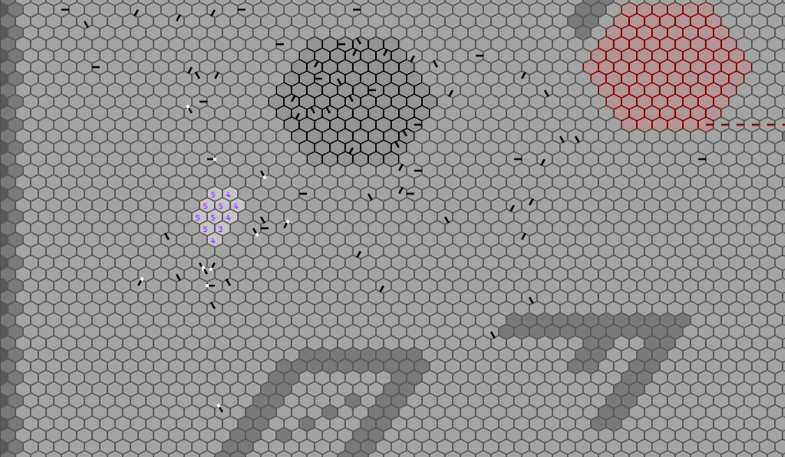

FastAnts
========

This is a Rust implementation of the simulator and visualizer for the ant language
used in 2004's edition of the [ICFP Programming Contest](https://alliance.seas.upenn.edu/~plclub/cgi-bin/contest/)

To try it out, go to `ant_viz` and run `cargo run --release`. Note that you will
need the nightly version of the Rust compiler, as some unstable features are
used by the `ant_lib` library.

Detailed instructions are shown below.

# Getting Rust

You need a recent enough nightly version of the Rust compiler. You can install
it by using [rustup](https://rustup.rs/) or by downloading a standalone installer
from the [official website](https://www.rust-lang.org/en-US/other-installers.html#standalone)

# Compiling and running

This should be as easy as getting into `ant_viz` and running `cargo run --release`.
The resulting binary is stored at `ant_viz/target/release`.

Note that the build requires a bunch of dependencies, so it may take three to five minutes
to compile for the first time.

Also, if you don't want the binary to be run afterwards, you can use `cargo build --release`
instead.

# Controls

Keyboard                | Action
----------------------- | -----------------------
Arrow keys              | Move camera around
t                       | Toggle scoreboard
m                       | Toggle mark showing
+ and -                 | Increase/decrease speed

# Specifying custom worlds and ant instructions

A CLI is not yet implemented. Coming soon!
